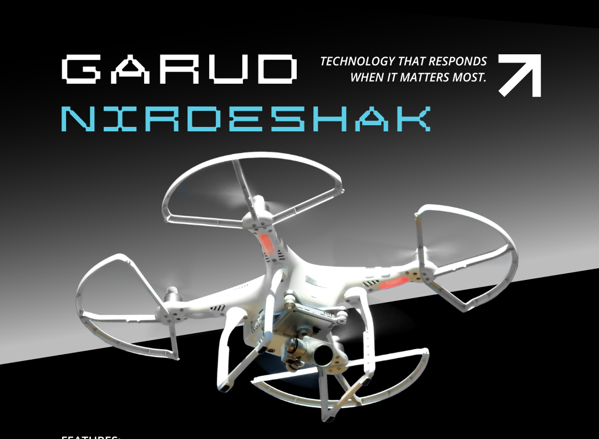

# 🦅 Garud-Nirdeshak: Drone-Assisted Disaster-Response System


  


## 🎯 Overview
Garud-Nirdeshak is a revolutionary drone-assisted navigation system designed to optimize emergency vehicle routing through real-time traffic monitoring and AI-powered path optimization.

<p align="center">
  
</p>

## 🎥 Video Showcase

[Watch our comprehensive dashboard demo to see Garud-Nirdeshak in action!](https://github.com/user-attachments/assets/420d07f7-11e7-487c-89cb-a11e92fa1fd6)


The video demonstrates:
- 📊 Real-time traffic monitoring interface
- 🛣️ Dynamic route optimization
- 🚨 Emergency response coordination
- 🎮 Interactive control features


## ✨ Key Features

<div style="display: flex; gap: 2rem; align-items: flex-start;">
<div style="flex: 3;">

- 🎥 Real-time drone video feed
- 🎤 Real-time audio capturing and analysis for human-like screams
- 🌡️ Infrared scanning to detect vital signs
- 🗺️ Interactive map visualization for victim location tracking
- 🔄 Smart emergency route optimization  
- 🚑 Emergency vehicle tracking and Live traffic monitoring for emergency vehicle routing
- 🤖 AI-powered decision support for emergency responders

</div>

<div style="flex: 2;">
    
</div>
</div>

<hr><br>

## 📊 Dashboard Feature

The **Garud-Nirdeshak Dashboard** serves as the central hub for monitoring and managing emergency response operations. It provides real-time insights and controls to ensure efficient coordination during critical situations.

### Key Components:

1. **Real-Time Data Visualization**:
   - Displays live updates on drone locations, status, and battery levels.
   - Visualizes traffic conditions and potential obstacles on the map.

2. **Audio and Video Feed Integration**:
   - Streams real-time video from drones equipped with cameras.
   - Captures audio input for analysis, allowing responders to detect distress signals.

3. **Route Optimization Interface**:
   - Provides dynamic route suggestions based on current traffic data.
   - Allows operators to manually adjust routes as needed for optimal emergency response.

4. **Alerts and Notifications**:
   - Sends immediate alerts for detected screams or unusual activity.
   - Notifies users of critical updates regarding drone status and emergency situations.

5. **Interactive Map**:
   - Features an interactive map interface that displays real-time locations of drones and emergency vehicles.
   - Users can zoom in/out and click on markers for detailed information about specific drones or incidents.

### Functionality Overview:

- **User-Friendly Controls**: The Dashboard is designed with intuitive controls that allow operators to easily manage multiple drones and track their operations simultaneously.
  
- **Data Analytics**: Provides insights into past incidents, helping improve future response strategies through data analysis.

- **Collaboration Tools**: Facilitates communication between team members through integrated messaging features, ensuring everyone is informed about ongoing operations.

### Screenshots

<p align="center">
  
  
</p>

<hr>
<br>


## 🛠️ Tech Stack
<p align="center">
  
  
  
  
</p>

## 🚀 Getting Started

### Prerequisites
- Python 3.8 or higher(3.11 specifically as the yolov8 works with this Python version only) 
- Node.js (v14 or higher)
- npm 
- Webcam access
- Git

### Installation

1. **Clone the repository**
   ```bash
   git clone https://github.com/your-username/garud-nirdeshak.git
   cd garud-nirdeshak
   ```


2. **Backend Setup**
   ```bash
   # Navigate to backend directory
   cd backend

   # Create virtual environment
   python -m venv venv

   # Activate virtual environment
   # On Windows:
   venv\Scripts\activate
   # On Mac/Linux:
   source venv/bin/activate

   # Install required packages
   pip install flask flask-cors opencv-python ultralytics numpy

   # Start the Flask server
   python app.py
   ```
   The backend server will run on http://localhost:5000

<br>

3. **Frontend Setup**
   ```bash
   # Open a new terminal
   # Navigate to frontend directory
   cd frontend

   # Install dependencies
   npm install

   # Start the development server
   npm start
   ```
   The frontend will run on http://localhost:3000 
   
   <br>

6. **Start the development server**
   ```bash
   npm run dev
   ```

### Running the Application

1. **Start Backend Server**
   - Ensure you're in the backend directory with activated virtual environment
   - Run `python app.py`
   - The server should start and display "Running on http://localhost:5000"

2. **Start Frontend Development Server**
   - In a new terminal, navigate to the frontend directory
   - Run `npm start`
   - Your default browser should open to http://localhost:3000

3. **Verify Setup**
   - You should see the dashboard with the video feed component
   - Click the "Start" button to begin video streaming
   - Try different modes using the mode selection buttons


## 🐛 Troubleshooting

### Common Issues

1. **Webcam Access Error**
   - Ensure no other application is using the webcam
   - Check browser permissions for camera access
   - Verify webcam is properly connected

2. **Backend Connection Issues**
   - Verify both servers are running
   - Check console for CORS errors
   - Ensure correct ports are being used

3. **Model Loading Issues**
   - First run might take longer (downloading YOLO model)
   - Check Python console for error messages
   - Verify internet connection for initial model download


## 📁 Project Structure
```
garud-nirdeshak/
├── 📂 src/
│ ├── 📂 components/
│ │ ├── 🗺️ DroneMap/
│ │ ├── 📹 VideoFeed/
│ │ └── ...
│ ├── 🎣 hooks/
│ ├── 🛠️ utils/
│ └── 📱 App.tsx
├── 📂 public/
├── 📂 garud-nirdeshak-backend/
│ ├── app.py
│ └── requirements.txt ... 
└── ...
```

## 🛠️ Tech Stack
- **Frontend**:
  - React with TypeScript
  - Tailwind CSS
  - Axios for API calls

- **Backend**:
  - Flask
  - OpenCV
  - YOLOv8
  - NumPy

<br>

## 📊 Project Stats


## 🌟 Features in Detail

### 🎥 Advanced Video Feed & Detection System
<details>
<summary>Click to expand</summary>
<br>


#### Vision Modes
- **Normal Mode**: Standard high-resolution video feed
- **Grayscale Mode**: Enhanced contrast for better object detection
- **Night Vision Mode**: Improved visibility in low-light conditions
- **Thermal Mode**: Heat signature detection for victim identification
- **Infrared Mode**: Deep scanning for hidden obstacles or victims

#### Detection Capabilities
- Real-time object detection using Lightweight YOLOv8 model
- Human presence detection in challenging conditions
- Movement pattern analysis
- Distance estimation and depth perception

#### Key Features
- Real-time processing and alerts
- Location marking on interactive map
- Automatic emergency response triggering
- Historical data logging for analysis

#### Coordination Features
- Real-time emergency vehicle tracking
- Dynamic route optimization
- Inter-agency communication platform
- Resource allocation management
</details>


### 🚦 Emergency Response Coordination
<details>
<summary>Click to expand</summary>
<br>

- Live tracking of emergency vehicles.
- Smart routing based on real-time traffic data.
</details>

### 🚦 Traffic Management
<details>
<summary>Click to expand</summary>
<br>

- Intelligent traffic light management
- Real-time congestion monitoring
- Predictive traffic flow analysis
</details>


#### Advanced Features for Future scope
- Machine learning-based congestion prediction
- Automated emergency vehicle path clearing
- Integration with city traffic systems
- Historical data analysis for optimization
</details>

### 📊 Analytics and Reporting
<details>
<summary>Click to expand</summary>
<br>


#### Real-time Analytics
- Response time metrics
- Resource utilization stats
- Success rate tracking
- System performance monitoring

#### Reporting Features
- Automated incident reports
- Performance analytics
- Resource allocation insights
- Trend analysis and predictions
</details>


### 🔐 Security and Privacy(Updating Soon)
<details>
<summary>Click to expand</summary>
<br>


#### Security Features
- End-to-end encryption
- Role-based access control
- Audit logging
- Data anonymization

#### Privacy Measures
- GDPR compliance
- Data retention policies
- Privacy-first design
- Secure data transmission
</details>


## 🤝 Contributing
Contributions are welcome! Please feel free to submit a Pull Request.

<a href="https://github.com/Rudra00codes/Garud-Nirdeshak/graphs/contributors">
  
</a>

## How to contribute to the Repository

1. Fork the repository
2. Create your feature branch
   ```bash
   git checkout -b feature/AmazingFeature
   ```
3. Commit your changes
   ```bash
   git commit -m 'Add some AmazingFeature'
   ```
4. Push to the branch
   ```bash
   git push origin feature/AmazingFeature
   ```
5. Open a Pull Request
## 📝 License
This project is licensed under the MIT License - see the [LICENSE](LICENSE) file for details.

```
MIT License

Copyright (c) 2024 [Your Name]

Permission is hereby granted, free of charge, to any person obtaining a copy
of this software and associated documentation files (the "Software"), to deal
in the Software without restriction, including without limitation the rights
to use, copy, modify, merge, publish, distribute, sublicense, and/or sell
copies of the Software, and to permit persons to whom the Software is
furnished to do so, subject to the following conditions:

[Rest of MIT License text...]

```

## 🙏 Acknowledgments
- Special thanks to all contributors
- YOLOv8 for object detection
- OpenCV for image processing
- All contributors and maintainers
- Inspired by the need for smarter emergency response systems
- Built with ❤️ for saving lives

---

<br>
<p align="center">
  Made with ❤️ by Team 
  <br>
  🌟 Star us on GitHub — it helps!
</p>  
